# 基于 DWT 与 CAT 的数字图像版权保护方法设计与实验分析
**——面向 512×512 彩色宿主图像与 256×256 水印图像的频域水印嵌入与提取研究**

**作者：王宇晨 2023141450323；李峰霆 2023141450241**  
**单位：四川大学电子信息学院 电子信息工程（保密方向）**

## 1. 摘要

针对数字图像在网络环境下易复制、易传播且难以追踪版权归属的问题，本文围绕课程项目要求，设计并实现了两种面向彩色图像版权保护的水印系统：基于离散小波变换（DWT）的频域嵌入方法，以及基于可逆四分组 CAT 风格变换的嵌入方法。其中，DWT 方案作为满足课程“基于频域分解完成水印嵌入与提取”核心要求的主方案，CAT 方案作为与题目扩展要求相配套的对比变换域方案。实验对象为 `512×512` 彩色宿主图像与 `256×256` 水印图像，系统完成了图像预处理、水印嵌入、非盲提取、不可见性评价、鲁棒性攻击实验以及结果可视化。本文在 `MATLAB R2023b` 环境中对 `alpha = 2, 4, 6, 8, 10` 五组嵌入强度进行了系统实验，并基于自动生成的 `9` 份 CSV 数据表和 `299` 张 PNG 图像完成分析。结果表明，两种方法在无攻击条件下均可实现接近无失真的水印提取；在不可见性方面，两者 `PSNR` 基本一致，而 CAT 方案在当前实验图像上的 `SSIM` 略高；在鲁棒性方面，DWT 对 JPEG 压缩更有优势，CAT 对中值滤波和椒盐噪声更稳定。综合考虑视觉质量、鲁棒性与课堂任务契合度，DWT 更适合作为标准频域水印基线方案，CAT 更贴合“four groups for transform domain”的课程描述并在当前数据上表现出更强的综合攻击稳定性。

## 2. 关键词

数字图像水印；版权保护；离散小波变换；CAT 四分组变换；不可见性；鲁棒性

## 3. 引言

数字图像版权保护是数字媒体安全中的基础问题。随着图像在社交平台、课程资源库、网络数据库中的快速传播，图像作品在脱离原始发布环境后往往失去有效的所有权标识，传统依靠文件名、文字说明或元数据的版权声明方法难以提供稳定、内嵌式的保护机制。数字水印技术通过将版权标识隐藏嵌入到宿主图像中，使得图像在正常浏览条件下保持较高视觉质量，同时在出现版权争议时可以通过提取过程恢复嵌入信息，因此成为数字版权认证和篡改追踪的重要手段。

与直接修改像素值的空间域方法相比，频域水印方法通常能够更好地协调不可见性和鲁棒性。一方面，频域表示可以更准确地识别图像的能量分布与结构特征，使嵌入位置的选择更加可控；另一方面，压缩、噪声、滤波等攻击在频域中具有更明确的响应规律，便于进行强度设计和性能分析。因此，在课程实验中同时考察 DWT 频域方法与 CAT 风格变换域方法，不仅有助于理解不同嵌入机制对性能的影响，也能更好地体现课堂中“不同变换域结构对应不同水印特性”的教学目标。

本次作业以 `512×512` 彩色宿主图像和 `256×256` 水印图像为统一输入规模，分别构建了两种水印系统。第一种方法基于 `YCbCr` 亮度通道的一层 Haar 小波分解，在 `HL` 子带中完成水印嵌入与非盲提取，对应课程作业中“基于频域分解完成版权保护方案设计”的核心要求；第二种方法基于“original image → CAT → four groups for transform domain”的课堂思想，将亮度通道做奇偶坐标可逆重排，形成四个 `256×256` group，并在选定 group 中嵌入水印，作为与主方案配套的结构化对比方法。本文的主要工作包括：完成两套系统的设计实现；对多组嵌入强度进行不可见性分析；在无攻击和多种攻击条件下评估提取性能；基于现有实验图表完成 DWT 与 CAT 的系统比较。

全文结构安排如下：第 4 节介绍相关原理与方法设计；第 5 节说明实验环境、实验流程与评价指标；第 6 节基于真实生成结果展开视觉分析、量化分析和鲁棒性对比；第 7 节给出结论；第 8 节总结不足与改进方向。

## 4. 相关原理与方法设计

### 4.1 数字图像水印基本原理

数字图像水印系统通常包含两个核心过程：嵌入与提取。嵌入阶段的目标是在尽量不破坏宿主图像视觉质量的前提下，将代表版权信息的水印图案写入宿主图像；提取阶段的目标是在可能存在失真、压缩或噪声攻击的条件下，尽可能准确地恢复原始水印。课程实验中通常从三个维度评价水印系统：

1. 不可见性：含水印图像与原图之间视觉差异尽量小，主观上不应出现明显伪影，客观上应具有较高 `PSNR`、`SSIM` 和较低 `MSE`。
2. 鲁棒性：图像在遭受压缩、噪声、滤波、裁剪等攻击后，仍能提取出可辨识水印，对应的 `NC`、`SSIM` 等指标应尽量保持较高。
3. 可检测性：提取结果应与原始水印具有足够高的相似度，使水印信息可被稳定确认。

从方法层面看，数字水印的核心问题在于折中。嵌入强度较小时，图像质量高但水印容易被攻击淹没；嵌入强度较大时，提取更稳定但视觉失真也随之上升。因此，对 `alpha` 的控制本质上是在不可见性和鲁棒性之间寻找平衡。

### 4.2 DWT 水印方法原理

离散小波变换能够把图像分解为不同尺度和方向的子带。对于二维图像的一层分解，可得到四个子带：

- `LL`：低频近似分量，反映主要亮度和轮廓；
- `LH`：水平方向细节；
- `HL`：垂直方向细节；
- `HH`：对角细节。

本实验首先将 RGB 宿主图像转换到 `YCbCr` 色彩空间，并优先在亮度通道 `Y` 上嵌入。这样做的原因在于：一方面可以避免直接在 RGB 三通道分别嵌入带来的色彩偏移；另一方面亮度通道承载了最主要的结构信息，更适合进行统一的频域分析。

对于 `512×512` 的宿主图像，经过一层二维 Haar 小波分解后，每个子带的尺寸均为 `256×256`，与课程要求的 `256×256` 水印尺寸完全一致，因此不需要额外分块、插值或拼接。本文默认选择 `HL` 子带作为嵌入位置。一方面，`HL` 子带相比 `LL` 子带对视觉感知更不敏感；另一方面，相比 `HH` 子带，`HL` 子带在实际图像中具有更稳定的能量分布，有利于兼顾不可见性与提取稳定性。

本实验采用加性嵌入模型。设原始子带为 `S`，嵌入强度为 `alpha`，二值水印经符号映射后得到 `P ∈ {-1, +1}`，则嵌入公式为：

```text
S_w = S + (alpha / 255) * P
```

式中 `alpha / 255` 表示将用户设置的 8 位像素级嵌入强度映射到 `double` 图像的 `[0, 1]` 范围。提取时采用非盲方式，利用原始宿主图像的参考子带 `S_ref` 与测试图像的子带 `S_test` 进行差分：

```text
P_hat = (S_test - S_ref) / (alpha / 255)
W_hat = (P_hat + 1) / 2
```

其中 `W_hat` 为提取得到的灰度水印估计，再经阈值化得到二值提取水印。

### 4.3 CAT 水印方法原理

课程中“original image → CAT → four groups for transform domain”的思想强调：通过变换或重排将原始图像映射到某种结构化域，在该域中形成若干可操作分组，再把水印与某个分组建立一一对应关系。本文采用了一个便于解释、严格可逆且与课程任务尺寸完全匹配的 CAT 风格四分组实现。设图像亮度通道为 `I`，则定义：

```text
G1 = I(1:2:end, 1:2:end)
G2 = I(1:2:end, 2:2:end)
G3 = I(2:2:end, 1:2:end)
G4 = I(2:2:end, 2:2:end)
```

对 `512×512` 图像来说，四个 group 的尺寸都为 `256×256`，因此可直接将 `256×256` 水印与某一个 group 对齐。本实验默认选择 `G2` 作为嵌入位置。该定义本质上是一种基于奇偶坐标的可逆重排：每个像素在原图中的坐标唯一决定其属于哪个 group；逆变换时，只需将四组数据按原位置重新放回即可恢复图像：

```text
I(1:2:end, 1:2:end) = G1
I(1:2:end, 2:2:end) = G2
I(2:2:end, 1:2:end) = G3
I(2:2:end, 2:2:end) = G4
```

因此该 CAT 风格实现是严格可逆的，不会引入额外重建误差。嵌入公式与 DWT 方案保持一致：

```text
G2_w = G2 + (alpha / 255) * P
```

提取时，分别对原图和测试图做四分组变换，利用对应 group 差分恢复水印：

```text
P_hat = (G2_test - G2_ref) / (alpha / 255)
W_hat = (P_hat + 1) / 2
```

### 4.4 两种方法的差异

尽管 DWT 与 CAT 都属于变换域意义上的处理方法，但两者机制存在明显差异。

| 比较维度 | DWT 方案 | CAT 方案 |
|---|---|---|
| 变换方式 | 一层 Haar 小波分解 | 奇偶坐标可逆重排形成四组 |
| 嵌入位置 | `Y` 通道 `HL` 子带 | `Y` 通道 `G2` 组 |
| 水印尺寸匹配 | 通过 1 层 DWT 后子带自然得到 `256×256` | 每个 group 天然为 `256×256` |
| 信息分布 | 修改频域细节系数 | 修改重排域采样组 |
| 实现复杂度 | 需要 DWT / IDWT 运算 | 结构简单，逆过程直接 |
| 可能的视觉影响 | 对边缘与纹理细节更敏感 | 对空间采样结构更直接 |
| 对鲁棒性的潜在影响 | 对压缩类攻击通常更有优势 | 对某些非线性噪声和滤波更稳定 |

从课程任务角度看，DWT 代表了较典型的频域水印方法，便于展示“在频域细节中嵌入水印”的标准思路；CAT 风格方案则更贴合“four groups for transform domain”的课堂描述，特别适合说明“先变换分组，再对某一组执行嵌入”的思想。

## 5. 实验设计

### 5.1 实验环境

本实验在 `MATLAB R2023b` 环境下完成，项目已自动生成并运行全部实验结果。输入图像规格如下：

- 宿主图像：`512×512` 彩色 RGB 图像；
- 水印图像：`256×256` 图像，实验中统一转换为灰度并进一步二值化；
- 色彩空间：嵌入与提取均在 `YCbCr` 的 `Y` 通道进行；
- 嵌入强度：`alpha = 2, 4, 6, 8, 10`；
- 水印模式：默认采用二值符号嵌入；
- 提取方式：非盲提取。

本报告基于项目自动生成的 `results/` 与 `docs/` 文件夹整理完成，其中包含 `9` 份 CSV 统计表、`299` 张 PNG 图片以及配套汇总文档。

### 5.2 实验流程

实验流程可以概括为以下六个阶段：

1. 输入图像预处理：读取原始宿主图像与水印图像，自动 resize 到规定尺寸，并生成灰度水印、二值水印与符号水印。
2. DWT 嵌入与提取：对 `Y` 通道做一层 Haar 小波分解，在 `HL` 子带中嵌入水印，再利用原始宿主图进行非盲提取。
3. CAT 嵌入与提取：对 `Y` 通道做四分组可逆重排，在 `G2` 组中嵌入水印，再通过逆变换重构含水印图像，并利用原始宿主图进行非盲提取。
4. 多 `alpha` 循环实验：分别在 `alpha = 2, 4, 6, 8, 10` 下运行两套方案，统计不可见性和提取性能。
5. 攻击实验：对含水印图像施加 JPEG 压缩、高斯噪声、椒盐噪声、中值滤波和裁剪缩放攻击，再次提取水印并统计指标。
6. 结果可视化与汇总：自动保存含水印图、差分图、提取水印图、曲线图、柱状图以及 CSV 表。

### 5.3 评价指标

为同时评估宿主图像质量与水印提取效果，本文采用四个指标。

#### 5.3.1 MSE

```text
MSE = (1 / MN) * ΣΣ (I(i, j) - Iw(i, j))^2
```

`MSE` 用于衡量含水印图像与原始图像之间的平均误差，值越小表示失真越小。

#### 5.3.2 PSNR

```text
PSNR = 10 * log10(MAX^2 / MSE)
```

由于图像已归一化到 `[0, 1]`，故 `MAX = 1`。`PSNR` 越高，表示图像质量越好。

#### 5.3.3 SSIM

`SSIM` 反映两幅图像在亮度、对比度和结构方面的相似度。对于水印系统而言，`SSIM` 能比 `PSNR` 更好地说明视觉结构是否被破坏。

#### 5.3.4 NC

```text
NC = sum(sum(W .* W_ext)) / sqrt(sum(sum(W.^2)) * sum(sum(W_ext.^2)))
```

`NC` 用于衡量原始水印与提取水印的相关程度，越接近 `1` 表示提取越准确。本文同时保留了无攻击条件下的 `NC` 与攻击条件下的 `NC` 变化曲线。

## 6. 实验结果与分析

### 6.1 原始图像与含水印图像的视觉对比分析

**图 1 原始宿主图像**


**图 2 原始灰度水印图像**

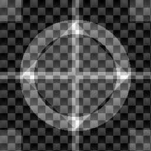

**图 3 原始二值水印图像**

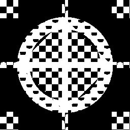

原始宿主图像包含渐变背景、纹理条纹、环状结构和局部高对比区域，能够同时考察水印方法对平滑区域、边缘区域和纹理区域的影响。原始水印既包含几何结构，又包含棋盘纹理和中心十字，适合用于观察提取过程中边缘保真与细节丢失情况。

#### 6.1.1 DWT 方案的视觉对比

**图 4 DWT 方案 `alpha=2` 可视化总览**


**图 5 DWT 方案 `alpha=6` 可视化总览**


**图 6 DWT 方案 `alpha=10` 可视化总览**

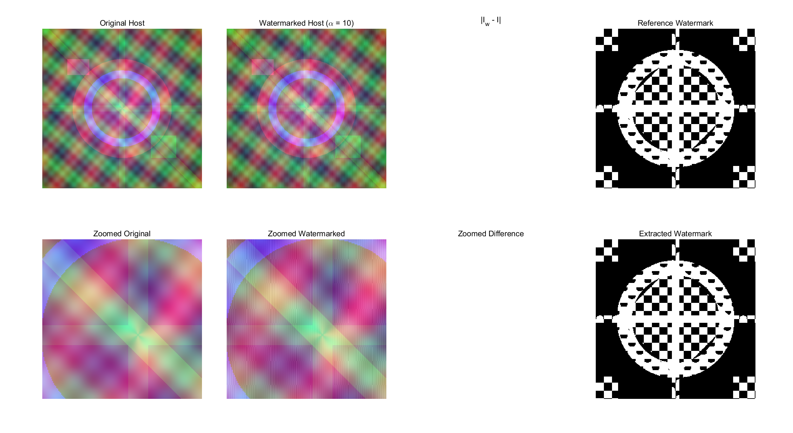

从 DWT 的三组代表性总览图可以看出，`alpha=2` 时含水印图像几乎与原图难以区分，差分图主要集中在图像细节区域，尤其是条纹纹理与环状边缘附近，说明 DWT 在 `HL` 子带中的修改更多体现在垂直细节和纹理变化上。随着 `alpha` 提升到 `6`，差分图对纹理区域的响应逐渐增强，但主体颜色与大尺度轮廓仍然稳定，说明嵌入主要改变的是高频结构而非整体亮度。

当 `alpha=10` 时，局部放大区域中的细微扰动已经较为明显，特别是在原图中存在高频纹理和对比边界的位置，放大图中的边缘细节开始出现更明显的亮度波动。这一现象与 DWT 方案的嵌入机制一致：由于修改直接发生在高频子带，随着嵌入强度增大，高频结构首先成为最敏感的位置。从主观视觉角度看，DWT 方案没有出现明显块效应和色彩漂移，但在大强度条件下，局部纹理区域的结构扰动比低强度时更显著。

#### 6.1.2 CAT 方案的视觉对比

**图 7 CAT 方案 `alpha=2` 可视化总览**


**图 8 CAT 方案 `alpha=6` 可视化总览**

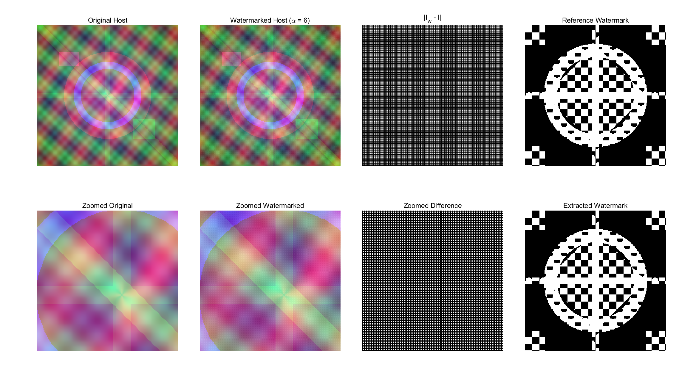

**图 9 CAT 方案 `alpha=10` 可视化总览**


CAT 方案在 `alpha=2` 时同样具有较高的主观不可见性。由于 CAT 实现采用的是奇偶坐标可逆重排，嵌入后的扰动在逆变换还原后表现为较均匀的空间分布，因此在整体视觉上并未出现集中于某个连续块区域的伪影。对比 `alpha=6` 和 `alpha=10` 的总览图可以发现，随着嵌入强度增加，差分图的变化范围有所扩大，但图像整体结构仍保持稳定，局部放大区域的纹理保持情况优于预期。

与 DWT 总览图对比时，可以观察到 CAT 方案虽然并非典型的小波频域修改，但其扰动在重排域中分布后，反映到空间域时具有一定的均匀性。这一点与后续 `SSIM` 指标的变化趋势相一致：在当前实验图像上，CAT 方案在各个 `alpha` 下的 `SSIM` 均高于 DWT。这说明在本次实验使用的宿主图像中，CAT 风格四分组方案在结构相似性的保持上具有一定优势。

### 6.2 不可见性量化分析

#### 6.2.1 DWT 方案不可见性指标

| alpha | PSNR/dB | SSIM | MSE |
|---:|---:|---:|---:|
| 2 | 46.8089 | 0.9853 | 0.000021 |
| 4 | 40.7883 | 0.9438 | 0.000083 |
| 6 | 37.2665 | 0.8825 | 0.000188 |
| 8 | 34.7677 | 0.8099 | 0.000334 |
| 10 | 32.8295 | 0.7336 | 0.000521 |

**图 10 DWT 方案 PSNR 曲线**


**图 11 DWT 方案 SSIM 曲线**

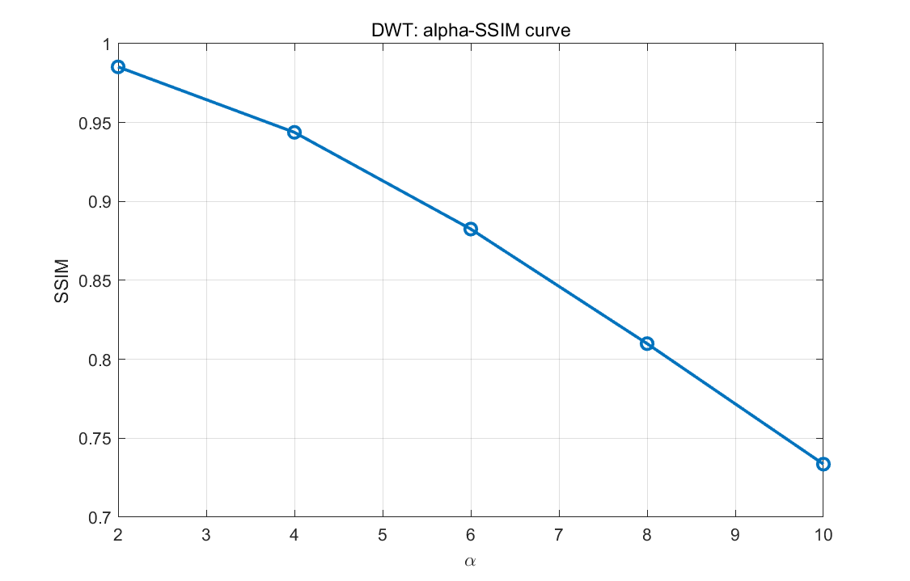

DWT 方案的量化结果呈现出典型的“强度增大，失真增加”规律。`alpha` 从 `2` 增大到 `10` 时，`PSNR` 从 `46.81 dB` 降至 `32.83 dB`，`SSIM` 从 `0.9853` 下降到 `0.7336`，而 `MSE` 从 `2.1×10^-5` 增加到 `5.2×10^-4`。这说明 DWT 在较小嵌入强度下具有非常好的视觉质量，但当嵌入增益不断增强时，高频子带的变化会逐步反映为结构相似性的下降。

#### 6.2.2 CAT 方案不可见性指标

| alpha | PSNR/dB | SSIM | MSE |
|---:|---:|---:|---:|
| 2 | 46.8089 | 0.9884 | 0.000021 |
| 4 | 40.7883 | 0.9554 | 0.000083 |
| 6 | 37.2665 | 0.9054 | 0.000188 |
| 8 | 34.7677 | 0.8444 | 0.000334 |
| 10 | 32.8296 | 0.7778 | 0.000521 |

**图 12 CAT 方案 PSNR 曲线**

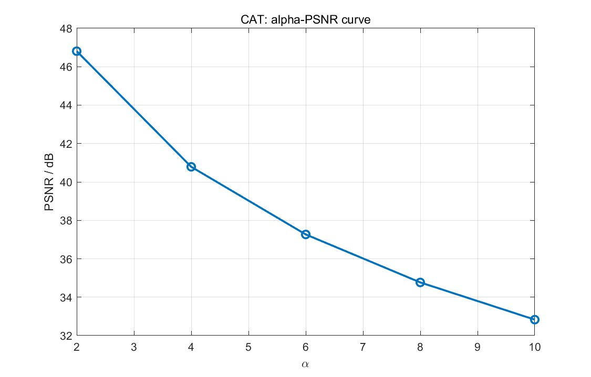

**图 13 CAT 方案 SSIM 曲线**

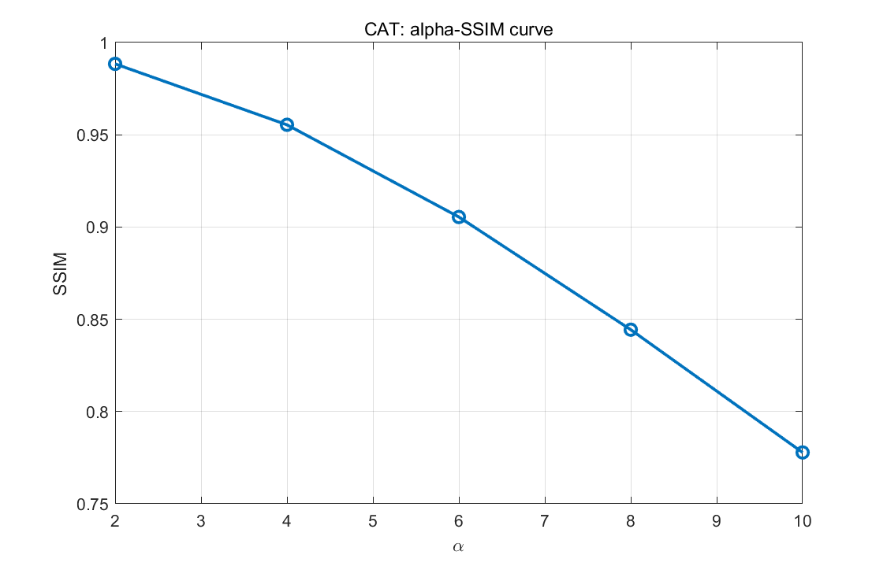

CAT 方案的 `PSNR` 与 DWT 基本重合，`MSE` 也几乎一致，这说明两种方案在当前实现中使用了相同量级的嵌入能量。然而，CAT 方案在所有 `alpha` 下的 `SSIM` 都高于 DWT，且差距随着 `alpha` 增大而扩大：在 `alpha=2` 时二者差距仅约 `0.0032`，到 `alpha=10` 时差距增大到约 `0.0442`。这表明在当前实验图像上，CAT 方案对整体结构相似性的保持更好。

#### 6.2.3 两种方案的不可见性比较

**图 14 两方案不可见性与平均鲁棒性综合对比图**

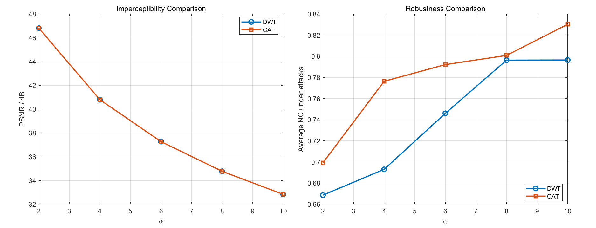

从量化结果和图 14 可以得出以下结论：

1. 在 `PSNR` 和 `MSE` 上，两种方案几乎完全一致，说明嵌入强度控制是公平的。
2. 在 `SSIM` 上，CAT 方案在当前实验图像中始终高于 DWT，说明其对结构的扰动更小。
3. 因此，在本次实验数据下，若优先强调不可见性，尤其是结构保真性，则 CAT 方案略优于 DWT。

需要指出的是，DWT 和 CAT 的不可见性差异并不来自“总能量不同”，而更多来自“扰动分布方式不同”。DWT 的扰动集中在高频细节，而 CAT 的扰动通过重排域分散回空间域，这也是两者 `PSNR` 接近但 `SSIM` 不同的主要原因。

### 6.3 无攻击条件下的水印提取效果分析

| alpha | DWT NC | DWT NC(binary) | CAT NC | CAT NC(binary) |
|---:|---:|---:|---:|---:|
| 2 | 1.0000 | 1.0000 | 1.0000 | 1.0000 |
| 4 | 1.0000 | 1.0000 | 1.0000 | 1.0000 |
| 6 | 1.0000 | 1.0000 | 1.0000 | 1.0000 |
| 8 | 1.0000 | 1.0000 | 1.0000 | 1.0000 |
| 10 | 1.0000 | 1.0000 | 1.0000 | 1.0000 |

**图 15 DWT 方案无攻击提取指标**

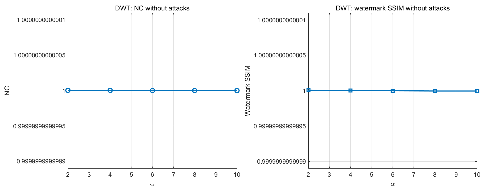

**图 16 CAT 方案无攻击提取指标**

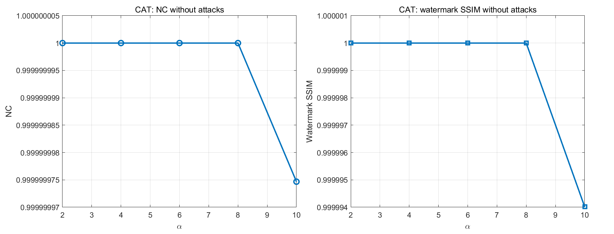

**图 17 DWT 方案 `alpha=2` 提取水印**


**图 18 CAT 方案 `alpha=2` 提取水印**


在无攻击条件下，两种方案几乎都实现了理想提取。DWT 与 CAT 的 `NC` 和 `NC(binary)` 均达到 `1.0000`，对应的水印 `SSIM` 也为 `1.0000`。这说明在默认二值符号嵌入和非盲提取条件下，原始宿主图像提供了足够准确的参考信息，使得两种方法都可以稳定恢复水印符号。

从图 17 和图 18 可以看出，提取水印与原始二值水印在视觉上几乎完全一致。由于本实验采用的是非盲提取且未引入随机扩频或量化噪声，`alpha` 对无攻击条件下的提取精度影响很小，主要影响体现在攻击场景下的鲁棒性提升，而不是无攻击条件下的正确恢复率。这一结果说明：在当前任务框架下，两种方法的核心差异不在“能否提取”，而在“在攻击存在时谁更稳健”。

### 6.4 攻击条件下的鲁棒性分析

#### 6.4.1 鲁棒性总体趋势

**图 19 DWT 方案各攻击 NC 柱状图**

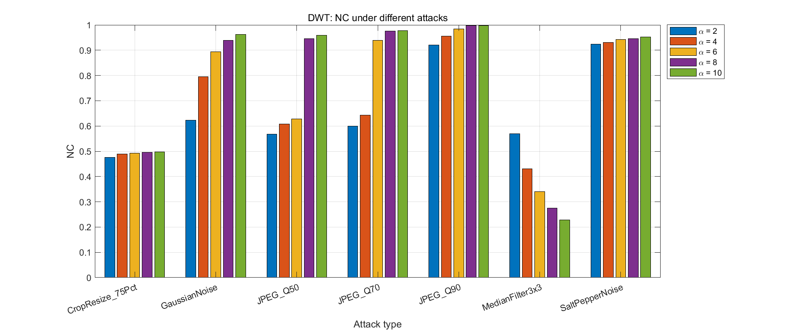

**图 20 CAT 方案各攻击 NC 柱状图**

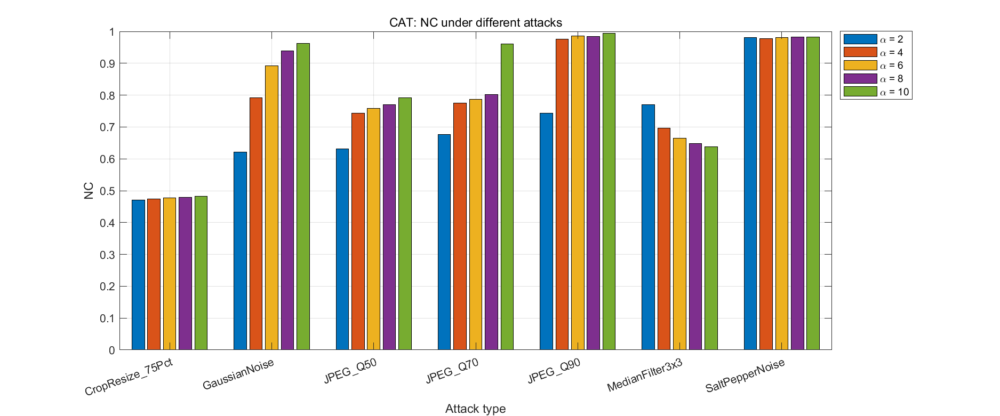

**图 21 DWT 方案鲁棒性随 alpha 变化曲线**

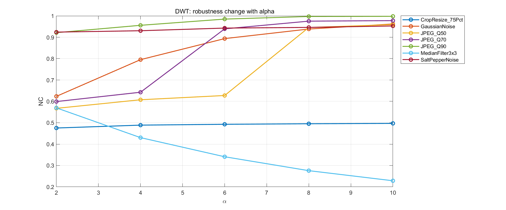

**图 22 CAT 方案鲁棒性随 alpha 变化曲线**

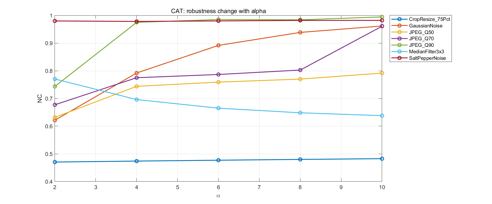

无论 DWT 还是 CAT，攻击条件下的总体规律都是一致的：`alpha` 增大时，平均 `NC` 整体提高，说明更强的嵌入增益确实增强了水印的可检测性。但这种增强并不是线性的。以 DWT 为例，攻击平均 `NC` 从 `alpha=2` 的 `0.6686` 提升到 `alpha=8` 的 `0.7963`，之后在 `alpha=10` 基本持平；CAT 则从 `0.6992` 提升到 `0.8302`。这表明在当前图像与攻击组合下，超过某个阈值后继续增大 `alpha` 的收益已经有限，而视觉代价还会继续增加。

进一步观察具体攻击类型，可以发现不同方法对攻击的敏感性差异非常明显。总体上，JPEG 压缩与高斯噪声对两种方法的破坏相对有限；中值滤波和裁剪缩放对水印结构破坏更强；椒盐噪声对 CAT 的影响明显小于对 DWT 的影响。

#### 6.4.2 JPEG 压缩、高斯噪声与椒盐噪声分析

| 攻击类型 | DWT 平均 NC | CAT 平均 NC | 更优方案 |
|---|---:|---:|---|
| JPEG_Q90 | 0.9714 | 0.9364 | DWT |
| JPEG_Q70 | 0.8268 | 0.8005 | DWT |
| JPEG_Q50 | 0.7414 | 0.7393 | DWT |
| GaussianNoise | 0.8425 | 0.8411 | DWT |
| SaltPepperNoise | 0.9392 | 0.9804 | CAT |

在 JPEG 压缩条件下，DWT 方案始终略优于 CAT，且质量因子越高，DWT 优势越明显。这与小波域嵌入的特点相一致：JPEG 压缩主要通过频域量化削弱高频信息，而 DWT 的 `HL` 子带修改在当前设置下仍保留了较强的相关性，因此具有更稳定的恢复能力。尤其是在 `JPEG_Q90` 下，DWT 的平均 `NC` 达到 `0.9714`，高于 CAT 的 `0.9364`。

高斯噪声条件下，两种方法表现几乎相同，平均 `NC` 分别为 `0.8425` 和 `0.8411`。这说明对加性随机噪声而言，两种嵌入方式都能保持较好的可检测性，方法差异并不显著。

椒盐噪声是一个值得注意的分界点。CAT 在该攻击下的平均 `NC` 达到 `0.9804`，明显优于 DWT 的 `0.9392`。由于 CAT 方案的水印信息分布在重排域 group 中，逆变换后在空间域更接近“均匀采样”式分布，对随机散点型脉冲噪声具有更强的容忍度。

#### 6.4.3 中值滤波与裁剪缩放分析

| 攻击类型 | DWT 平均 NC | CAT 平均 NC | 现象说明 |
|---|---:|---:|---|
| MedianFilter3x3 | 0.3691 | 0.6835 | DWT 受损最明显，CAT 保留较多结构 |
| CropResize_75Pct | 0.4899 | 0.4768 | 两者都较脆弱，DWT 略好 |

中值滤波是本实验中 DWT 的最弱项。DWT 在 `3×3` 中值滤波下的平均 `NC` 仅为 `0.3691`，远低于 CAT 的 `0.6835`。造成这一现象的原因在于：中值滤波会显著抑制局部尖锐变化，而 DWT 的嵌入信息主要集中在高频细节子带中，因此更容易被平滑操作削弱；相比之下，CAT 的扰动是经过重排再恢复到空间域中的，对局部平滑的敏感性略低。

裁剪缩放对两种方法都是明显挑战。DWT 与 CAT 的平均 `NC` 分别为 `0.4899` 和 `0.4768`，都不足 `0.5`。这表明无论是在频域子带还是在四分组重排域中，当前实现都尚未对几何攻击建立专门补偿机制。裁剪会破坏原始位置关系，后续 resize 虽然恢复了图像尺寸，但不能恢复原始空间对应，因此对非盲差分提取十分不利。

#### 6.4.4 典型攻击样例分析

**图 23 DWT 方案 `alpha=10` 下 JPEG_Q50 攻击图像**


**图 24 DWT 方案 `alpha=10` 下 JPEG_Q50 攻击后提取水印**

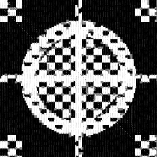

**图 25 DWT 方案 `alpha=10` 下中值滤波后提取水印**

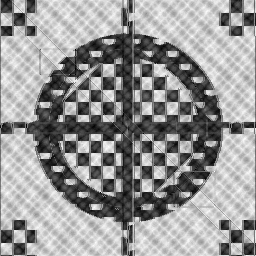

图 23 至图 25 体现了 DWT 方案的典型特征：在中等 JPEG 压缩下，提取结果仍保留较清晰的主体轮廓，说明 DWT 对压缩类攻击较强；而在中值滤波后，提取图中细节结构出现明显模糊和断裂，定量上也对应较低的 `NC`。

**图 26 CAT 方案 `alpha=10` 下椒盐噪声攻击图像**


**图 27 CAT 方案 `alpha=10` 下椒盐噪声后提取水印**

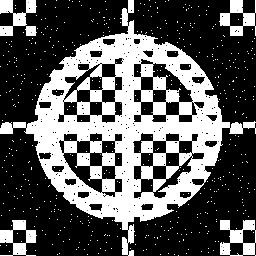

**图 28 CAT 方案 `alpha=10` 下中值滤波后提取水印**

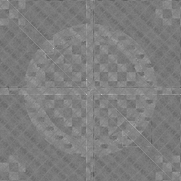

CAT 方案的典型样例则体现出另一面：在椒盐噪声条件下，提取水印依然保持了较高的可辨识度，这与其在该攻击下平均 `NC` 最高的结果一致；在中值滤波后，CAT 虽然也出现了细节衰减，但总体轮廓仍明显优于 DWT 的对应结果。由此可见，CAT 在非线性脉冲类噪声与平滑类攻击下具有更好的稳定性。

#### 6.4.5 `alpha=10` 条件下的攻击细分比较

**图 29 `alpha=10` 条件下两方案按攻击类型的 NC 比较**

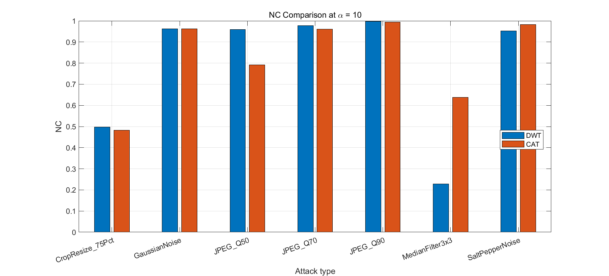

| 攻击类型 | DWT NC (`alpha=10`) | CAT NC (`alpha=10`) | 更优方案 |
|---|---:|---:|---|
| JPEG_Q90 | 0.9979 | 0.9945 | DWT |
| JPEG_Q70 | 0.9778 | 0.9609 | DWT |
| JPEG_Q50 | 0.9590 | 0.7917 | DWT |
| GaussianNoise | 0.9620 | 0.9618 | 基本持平 |
| SaltPepperNoise | 0.9529 | 0.9820 | CAT |
| MedianFilter3x3 | 0.2286 | 0.6380 | CAT |
| CropResize_75Pct | 0.4970 | 0.4826 | DWT |

当 `alpha=10` 时，两种方案的差异更加清晰。DWT 在三种 JPEG 压缩等级下都优于 CAT，且在 `JPEG_Q50` 下优势最明显；CAT 在椒盐噪声和中值滤波下占据显著优势；GaussianNoise 下两者几乎一致；CropResize 下二者都不理想。换言之，DWT 更像“压缩友好型”方案，CAT 更像“噪声与平滑攻击更稳”的方案。

### 6.5 DWT 与 CAT 两种方案的综合对比分析

| 对比维度 | DWT | CAT |
|---|---|---|
| 变换方式 | 一层 Haar 小波分解，修改 `HL` 子带 | 奇偶坐标重排形成四组，修改 `G2` |
| 水印尺寸匹配 | `512×512` 经 1 层 DWT 后子带自然为 `256×256` | 四个 group 自然为 `256×256` |
| 不可见性 | `PSNR` 高，`SSIM` 随 `alpha` 上升下降较快 | `PSNR` 与 DWT 接近，`SSIM` 整体更高 |
| 无攻击提取 | 非盲提取可近乎无误恢复 | 非盲提取可近乎无误恢复 |
| 对 JPEG 的表现 | 明显更强 | 略弱于 DWT |
| 对高斯噪声的表现 | 与 CAT 接近 | 与 DWT 接近 |
| 对椒盐噪声的表现 | 较强，但不及 CAT | 更强 |
| 对中值滤波的表现 | 明显较弱 | 明显较强 |
| 对裁剪缩放的表现 | 略好，但整体都较弱 | 略弱 |
| 实现复杂度 | 中等，需要 DWT/IDWT | 较低，逆过程直接 |
| 与课堂内容契合度 | 贴合频域水印经典思路 | 最贴合“CAT four groups”描述 |

从综合实验结果看，当前实验图像和参数设置下，若重点强调图像结构保真与综合攻击鲁棒性，CAT 方案更具优势；若重点强调对 JPEG 压缩的稳定性，则 DWT 更值得优先采用。换言之，二者并不存在绝对优劣，而是体现出不同变换机制下的性能侧重。

第一，关于不可见性。由于两种方案的 `PSNR` 几乎一致，因此不能简单依据 `PSNR` 判断谁更优；真正拉开差异的是 `SSIM`。CAT 在 `alpha=2~10` 的全部区间都保持更高的结构相似性，说明其在当前宿主图像上对整体视觉结构更友好。因此，在强调主观自然度与结构保真的评价框架下，CAT 的实验结果更具优势。

第二，关于鲁棒性。若把攻击看成一个混合集合，CAT 的平均攻击后 `NC` 在所有 `alpha` 下都高于 DWT，尤其在 `alpha=10` 时达到 `0.8302`，高于 DWT 的 `0.7965`。但若把攻击类型拆开看，DWT 在 JPEG_Q90、JPEG_Q70、JPEG_Q50 上都优于 CAT，说明 DWT 的鲁棒性优势是“有针对性的”，而 CAT 的鲁棒性优势是“综合性的”。据此可归纳为：**DWT 更适合强调压缩鲁棒性，CAT 更适合强调综合鲁棒性和课堂中的 four groups 结构表达。**

第三，关于课程场景适配性。DWT 是标准的频域嵌入方案，理论基础成熟，便于与教材中的子带分析、频域能量分布和高低频特性相对应；CAT 风格四分组方案则更贴近题目对“four groups for transform domain”的明确要求，且其逆过程简单、结构清楚，特别适合写作课程报告时解释“为什么是四组、为什么可逆、为什么尺寸正好对应”。

## 7. 结论

本文围绕数字图像版权保护问题，完成了两种水印系统的设计、实现与实验分析。一种是基于 DWT 的频域水印方法，通过在 `YCbCr` 亮度通道的一层 Haar 小波 `HL` 子带中嵌入水印，实现了经典频域嵌入框架；另一种是基于 CAT 风格四分组可逆重排的水印方法，通过将亮度通道划分为四个 `256×256` group，在 `G2` 中进行加性嵌入，实现了与课堂“four groups for transform domain”描述高度一致的方案。

从实验目标完成情况看，两种方法均实现了宿主图像预处理、水印嵌入、非盲提取、不可见性量化评价以及多种攻击条件下的鲁棒性分析。项目自动生成了原始图像、含水印图像、差分图、提取水印图、曲线图、柱状图以及汇总 CSV 表，为形成完整课程作业报告提供了充分依据。

从不可见性角度看，两种方案在 `PSNR` 和 `MSE` 上几乎完全一致，说明嵌入能量控制总体公平；但 CAT 方案在当前实验图像上的 `SSIM` 始终高于 DWT，表明其对结构相似性的保持更优。因此，在本次实验数据上，若把“图像看起来更自然”作为优先目标，则 CAT 方案更具优势。

从鲁棒性角度看，两种方法在无攻击条件下都可实现近乎无误的水印提取；在攻击条件下，DWT 对 JPEG 压缩表现更强，而 CAT 对椒盐噪声和中值滤波表现更好，且在综合平均 `NC` 上高于 DWT。也就是说，DWT 更适合强调压缩鲁棒性，CAT 更适合强调混合攻击下的总体稳定性。

综合全文实验结果，可以给出最终结论：在课程作业场景下，DWT 方案适合作为标准频域方法展示“经典、规范、便于解释”的一面；CAT 方案则更适合作为与题目要求深度契合的对比方法，尤其在当前数据上同时体现了较好的结构保真性和更强的综合鲁棒性。若从“课程题目契合度、结果对比清晰度与分析完整性”三个维度综合评价，则应将 DWT 视为标准频域基线，将 CAT 视为具有结构设计特色的补充比较方案。

## 8. 不足与改进方向

尽管本文已经完成了两种水印方案的系统实验，但当前实现仍存在若干局限。首先，提取方式采用的是非盲提取，即提取阶段需要原始宿主图像参与参考。这种方法虽然有利于课程实验中稳定观察算法性能，但在实际应用场景中限制较大，因为很多真实版权认证任务并不能方便地获得原始宿主图像。

其次，当前嵌入方式采用了固定增益的加性模型，没有根据局部纹理复杂度、边缘强度或视觉掩蔽特性进行自适应调节。这样虽然实现简单、便于对比，但在平滑区域和高纹理区域使用相同嵌入强度，未必能够达到最优的不可见性与鲁棒性平衡。

再次，本文重点考察了 JPEG 压缩、噪声、滤波和裁剪缩放等常见攻击，但尚未覆盖旋转、仿射变换、尺度变化、平移等几何攻击。当前两种方法在裁剪缩放下的 `NC` 都偏低，说明对几何失真的鲁棒性仍然不足，这也是后续改进的重点方向。

未来可以从以下几个方面进一步拓展：

1. 由非盲提取扩展到盲提取或半盲提取，提高实际适用性；
2. 将 DWT 与 DCT、SVD 等方法结合，构建复合变换域嵌入模型；
3. 在 CAT 风格方案中引入多轮置乱、密钥控制或分层嵌入机制；
4. 根据局部能量和视觉掩蔽特性设计自适应 `alpha`；
5. 针对几何攻击引入同步模板、特征点校正或鲁棒配准策略。

综上，本文的实验已经较完整地体现了数字图像水印系统在“不可见性—鲁棒性”之间的典型折中关系，也为后续在更复杂攻击场景下优化频域水印算法奠定了基础。
